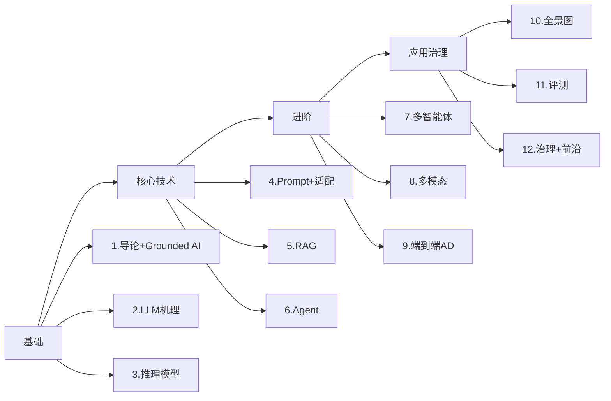

## 🎯 课程地图

## 📚 快速链接

- 📖 [完整大纲](/syllabus)
- 🚦 [第 1 讲：导论 + Grounded AI](/lectures/01-introduction)
- 🛠 [实验手册](/labs)
- 🎯 [期末项目](/projects)
- 📋 [AI 使用政策](/policy)

## 🏆 学生项目展示

> 2025 春季学生项目精选（待添加）

- 🚀 **智能公交信号优先系统**：基于多智能体协商
- 🛰 **遥感影像道路病害检测**：VLM 微调
- 🧭 **盲道无障碍出行助手**：Agent + RAG
- 📊 **12345 投诉自动归因**：GraphRAG

## 📢 最新动态

- 📅 **2026-08-28**：课程仓库初始化
- 📅 **2026-09-18**：开课（周五 14:00-15:30）
- 📅 **2026-09-18**：第 1 讲上线
- 📅 **2026-XX-XX**：专家课 #1（待定）

## 🤝 参与贡献

欢迎提交 Issue / PR 改进课件、补充案例、修复错误。

详见 [GitHub 仓库](https://github.com/runningjian-ui/tongji-llm-urban-transport)。
