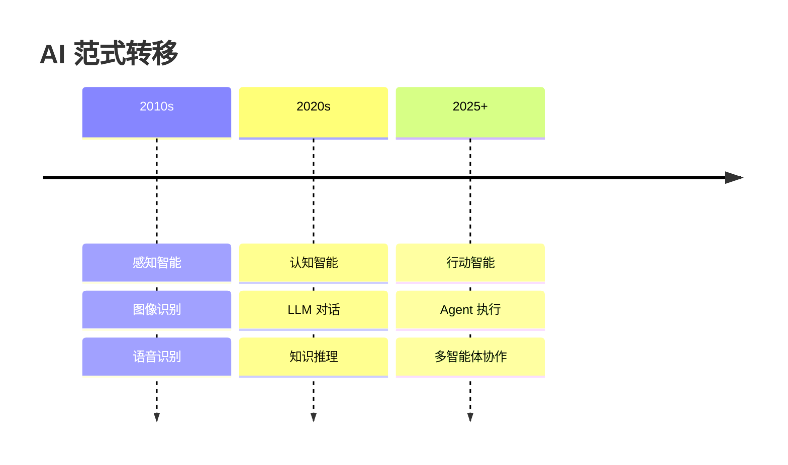
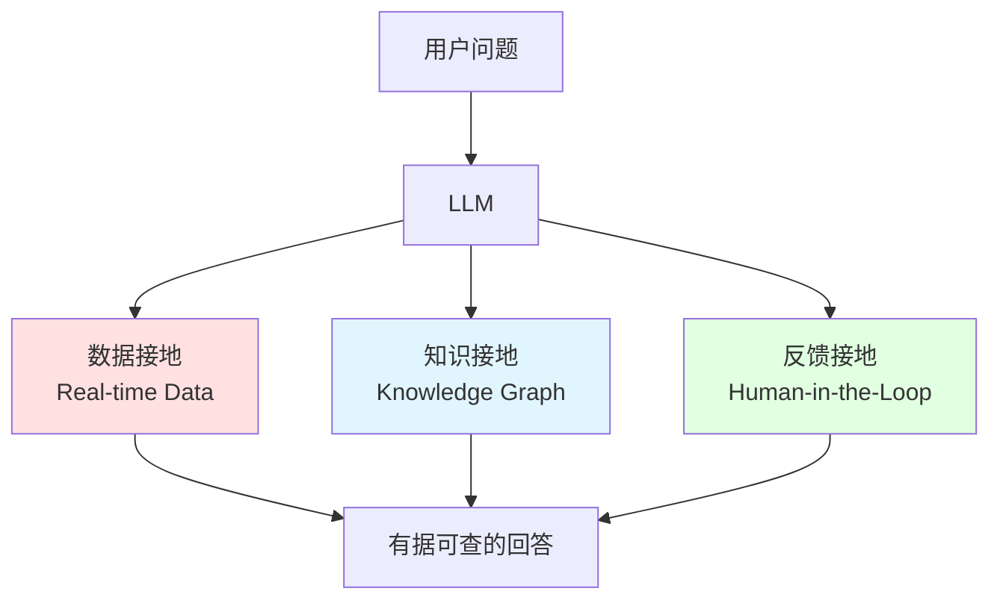

# 🚦 大模型驱动的城市交通治理技术

# 第 1 讲：Grounded AI for Transportation

同济大学交通学院 · 李健 · 2026 春季

v1.0 · Last updated 2026-08

---
layout: section
---

# 先问一个问题

> 如果你是一名交通管理者，凌晨 3 点收到一份 200 页的城市交通运行报告，
> 你会怎么办？

---
transition: fade-out
---

# 你会怎么办？

### 传统方式
- 喝杯咖啡 ⏰
- 通读报告 📑
- 摘出关键指标 ✍️
- 撰写摘要 ⏰
- 写给领导决策 📧

**耗时 3-4 小时**

### LLM 时代
- 把 PDF 丢给 ChatGPT 📤
- 30 秒生成摘要 ⚡
- 自动提取关键指标 🤖
- 标注数据来源 📊
- 生成决策建议 💡

**耗时 3 分钟**

⚠️ <b>但如果 LLM 编造数据呢？</b> 
如果它说"外滩早高峰 8:30 拥堵指数 7.2"——这是真的吗？

---
layout: center
---

# 这就是 Grounded AI 要解决的问题

让 LLM 说的每一句话 
都能 <b class="text-red-500">追溯到真实数据</b> 
而不是凭空捏造

---
layout: section
---

# Part 1: 为什么是现在？

---

# AI 的三波浪潮

### 🌊 第一波：Chat 模型
**2022 - 2023**

- ChatGPT (2022.11)
- GPT-4 (2023.03)
- Claude (2023.03)

**能力**：对话、写作、翻译

**交通应用**：客服、文案

### 🧠 第二波：推理模型
**2024 - 2025**

- OpenAI o1 (2024.09)
- DeepSeek R1 (2025.01)
- Claude Extended Thinking

**能力**：慢思考、复杂推理

**交通应用**：路径规划、调度优化

### 🤖 第三波：自主 Agent
**2025 -**

- Devin (2024.12)
- Manus (2025.03)
- OpenAI Operator (2025.01)

**能力**：自主规划、工具使用

**交通应用**：交通治理 Copilot

---

# AI 范式的三次转移

交通领域正在经历从 <b>感知→认知→行动</b> 的全面重塑

---

# LLM 介入交通的 4 类角色

| 角色 | 类比 | 典型任务 | 关键能力 |
|---|---|---|---|
| 🗣 **助手** | 副驾驶 | 报告生成、解释 | 对话、文案 |
| 🧭 **规划器** | 调度长 | 路径规划、信号配时 | 推理、工具调用 |
| 🔍 **评估器** | 审计员 | 异常归因、影响评估 | 评测、对比 |
| 🤝 **协调器** | 交通指挥 | 多方协商、应急调度 | 多智能体 |

💡 真实场景中，这 4 类角色往往<b>协同工作</b>，而不是单一使用

---
layout: section
---

# Part 2: 为什么是交通？

---

# 城市交通的"老问题"

### 🚗 拥堵
- 北京/上海年均通勤时间 40+ 分钟
- 每年因拥堵损失 GDP 1-2%

### ⚠️ 安全
- 全球每年 130 万人死于交通事故
- 90% 事故由人为因素导致

### 🌱 低碳
- 交通占全球碳排放 16%
- 私家车通勤占 75%

### ⚖️ 公平
- 老年人、残疾人出行难
- 郊区 vs 中心城区服务差异

---

# 过去 20 年的 AI 方案

| 阶段 | 时间 | 主要方法 | 解决问题 |
|---|---|---|---|
| 1. 统计学习 | 2000-2010 | ARIMA、SVM | 流量预测 |
| 2. 深度学习 | 2010-2020 | CNN、RNN、GCN | 感知、预测 |
| 3. 强化学习 | 2015-2025 | DQN、PPO | 信号控制、调度 |
| 4. 大模型 | 2023- | Transformer、LLM | 通用推理、生成 |

🤔 <b>问题</b>：前 3 阶段解决了<b>单点问题</b>，但缺少<b>跨任务协同</b>

LLM 提供了<b>通用接口</b>，可能是范式突破

---

# LLM vs 传统 AI 在交通中的差异

| 维度 | 传统 AI | LLM |
|---|---|---|
| 数据需求 | 大量标注 | 少量样本甚至零样本 |
| 任务通用性 | 单任务专用 | 一个模型多任务 |
| 推理能力 | 模式匹配 | 复杂逻辑推理 |
| 可解释性 | 黑盒 | 自然语言解释 |
| 知识更新 | 重新训练 | 检索增强 (RAG) |
| 与人交互 | API 调用 | 自然语言 |

⚠️ <b>但 LLM 不是万能的</b>：
- 幻觉问题
- 实时性差
- 缺乏领域知识
- 难以做精确数值计算

---
layout: section
---

# Part 3: Grounded AI - 课程主线条

---

# 什么是 Grounded AI？

> AI 的输出必须 <b class="text-red-500">扎根真实世界</b>——
> 数据、知识、上下文、人类反馈。

 

> — Prof. Jinhua Zhao, MIT

### 与"幻觉 (Hallucination)"的关系

| | 不 Grounded | Grounded |
|---|---|---|
| 现象 | LLM 自由发挥 | LLM 引用数据 |
| 风险 | 编造事实 | 错误可追溯 |
| 信任 | 无法验证 | 可审计 |

---

# Grounded AI 的三层架构

---

# 交通领域 Grounded 的 5 个例子

| 场景 | 不 Grounded | Grounded |
|---|---|---|
| "上海哪条路最堵" | LLM 自由回答 | 引用高德实时数据 API |
| "为什么这个信号配时这样设置" | 编造理由 | 引用 GB 25280 规范 + 历史日志 |
| "这个事故原因是什么" | 通用回答 | 检索类似事故归因报告 |
| "这个出行方案公平吗" | 模糊回答 | 接入公平性指标 benchmark |
| "模型预测准不准" | 凭感觉 | 接入 LLM-as-Judge 评测 |

💡 <b>核心区别</b>：Grounded 让 AI 从<b>能聊</b>变成<b>能信</b>

---
layout: section
---

# Part 4: 12 讲地图

---

# 12 讲全景图

```mermaid {scale: 0.7}
graph LR
  subgraph 基础
    A1[1. 导论<br/>Grounded AI]
    A2[2. LLM 机理]
    A3[3. 推理模型]
  end

  subgraph 核心技术
    B1[4. Prompt+适配]
    B2[5. RAG 进阶]
    B3[6. Agent]
  end

  subgraph 进阶
    C1[7. 多智能体]
    C2[8. 多模态]
    C3[9. 端到端 AD]
  end

  subgraph 治理
    D1[10. 全景图]
    D2[11. 评测]
    D3[12. 治理+前沿]
  end

  A1 --> A2 --> A3 --> B1 --> B2 --> B3 --> C1 --> C2 --> C3 --> D1 --> D2 --> D3

  style A1 fill:#ffcccc
  style A2 fill:#ffcccc
  style A3 fill:#ffcccc
  style B1 fill:#cce5ff
  style B2 fill:#cce5ff
  style B3 fill:#cce5ff
  style C1 fill:#ccffcc
  style C2 fill:#ccffcc
  style C3 fill:#ccffcc
  style D1 fill:#ffe5cc
  style D2 fill:#ffe5cc
  style D3 fill:#ffe5cc
```

---

# 12 讲对应 5 类能力

| 能力 | 对应讲次 | 关键问题 |
|---|---|---|
| 🧠 **理解机理** | 2, 3 | LLM 到底怎么工作？ |
| 🛠 **掌握工具** | 4, 5, 6 | 怎么让 LLM 接外部世界？ |
| 👥 **协同智能** | 7, 8, 9 | 怎么让多个 LLM 一起工作？ |
| 🏙 **落地场景** | 10 | 在交通治理的全景图是什么？ |
| 🔍 **评估反思** | 11, 12 | 怎么知道它答得对？ |

---
layout: section
---

# Part 5: 课程安排

---

# 考核方式

| 项目 | 占比 | 说明 |
|---|---|---|
| 课堂作业 | 30% | 8 次 × 5-10 分 |
| Recitation Lab | 20% | 4 次实验 |
| 期末项目 | 40% | 3 人一组 |
| 期末反思 | 10% | 1 页 |

### 关键节点
- **W6**：项目 Proposal
- **W10**：中期检查
- **W15**：终期汇报

---

# AI 使用政策：Allowed with disclosure

> "教 GenAI 的课，禁止用 GenAI 是矛盾的。"
> — Prof. Seongjin Choi, UMN

### ✅ 允许
- Cursor/Copilot 写 boilerplate
- 让 GPT-4 帮你 debug
- 头脑风暴
- 文献翻译
- 数据分析代码

### ❌ 禁止
- 完全代写作业
- 让 AI 完成考试
- 抄袭 AI 内容不披露
- 假装 AI 观点是你自己的

📋 <b>必须</b>：每次作业附 <code>.ai-disclosure.md</code>

---

# 推荐阅读

**Week 1 必读**：

1. **Nie, T., Sun, J., & Ma, W. (2025)**. *Exploring the roles of large language models in reshaping transportation systems: A survey, framework, and roadmap*. AI for Transportation.
   📄 [arXiv](https://arxiv.org) · 必读前 3 章

2. **Choi, S. et al. (2025)**. *A gentle introduction and tutorial on deep generative models in transportation research*. TR-C.
   📄 [GitHub](https://github.com/UMN-Choi-Lab/DGMinTransportation)

3. **Vaswani et al. (2017)**. *Attention Is All You Need*. NeurIPS.
   📄 [arXiv](https://arxiv.org/abs/1706.03762) · 经典论文

**选读**：

- Jinhua Zhao, "Mens, Manus and Machina" 研究框架
- [Grounded AI 资料](https://mit-mi.github.io)

---
layout: section
---

# 课堂演示

---

# 演示：让 LLM 读懂《上海交通运行报告》

### 目标
让 LLM 生成一份关于"上海早高峰拥堵"的分析，<b>且每个数据点都能追溯到原始报告</b>

### 步骤

1. 准备《2025 上海交通运行年度报告》PDF
2. 用 RAG 把 PDF 切片、向量化
3. 让 LLM 回答："上海外滩早高峰几点最堵？为什么？"
4. 验证：每个数据点都能找到 PDF 原文章节

### 预期结果

- 不 Grounded：LLM 编造数据
- Grounded：每个数据带 `[1] 报告 P.23` 引用

💻 代码示例见 <code>lectures/01-introduction/demo/</code>

---
layout: section
---

# 作业 0

---

# HW0：选定你的研究问题

### 任务
选定一个你关注的交通子领域，提交 1 段"问题陈述 + 数据来源"（≤500 字）

### 提交方式
- Fork 本仓库
- 在 <code>assignments/hw0-proposal/</code> 下创建 <code>{your-name}.md</code>
- 提交 Pull Request

### 评分（5 分）
| 维度 | 分值 |
|---|---|
| 问题清晰度 | 2 |
| 数据可获得性 | 2 |
| Grounded 程度 | 1 |

### 截止
**W2 课程结束前**

---
layout: center
---

# Q & A

任何关于课程安排、政策、项目的问题，欢迎现在提出

- 📧 Email: lijian@tongji.edu.cn
- 💬 GitHub Discussions: [讨论区](https://github.com/runningjian-ui/tongji-llm-urban-transport/discussions)
- 🕐 Office Hour: 周三 19:00-21:00

---
layout: end
---

# 🚦 让我们开始这段旅程

下一讲：**第 2 讲 · LLM 内部机理**

从 Tokenization 到 RLHF，理解大模型是怎么"思考"的

本课件采用 [Slidev](https://sli.dev) 构建 · CC-BY-SA-4.0

